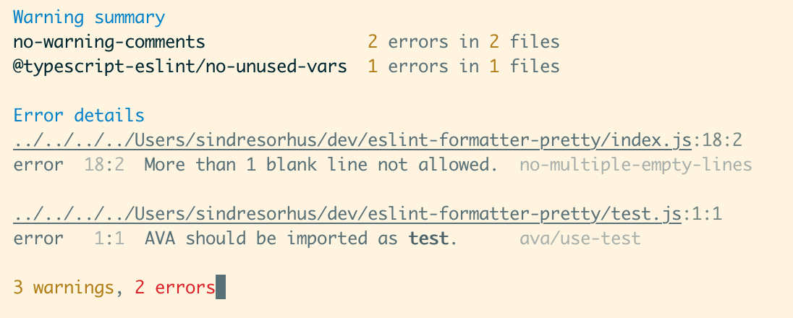

# eslint-formatter-pretty-summary

> Pretty summary formatter for [ESLint](https://eslint.org)

Meant for those projects where there are too many warnings to use the full pretty formatter.



## Highlights

- Pretty output.
- Only displays full results for errors
- Summarizes non-error results
- Stylizes inline codeblocks in messages.
- Command-click a rule ID to open its docs.
- Command-click a header to reveal the first error in your editor. _(iTerm-only)_

## Install

```
$ npm install --save-dev eslint-formatter-pretty-summary
```

## Usage

### ESLint CLI

```
$ eslint --format=pretty-summary file.js
```

## Tips

In iTerm, <kbd>Command</kbd>-click the filename header to open the file in your editor.

In [terminals with support for hyperlinks](https://gist.github.com/egmontkob/eb114294efbcd5adb1944c9f3cb5feda#supporting-apps), <kbd>Command</kbd>-click the rule ID to open its docs.
